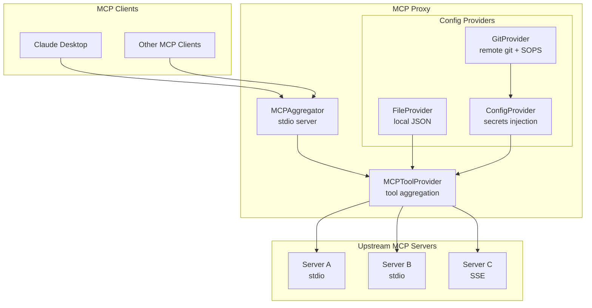

# MCP Proxy

An MCP (Model Context Protocol) aggregator server that combines multiple MCP servers into a single unified interface.

## Architecture



## Key Components

| Component | Description |
|-----------|-------------|
| **MCPAggregator** | MCP server that exposes aggregated tools via stdio transport |
| **MCPToolProvider** | Connects to multiple upstream MCP servers and aggregates their tools |
| **FileProvider** | Loads configuration from a local JSON file |
| **GitProvider** | Loads configuration from a git repository with SOPS decryption support |
| **ConfigProvider** | Combines config and secrets providers with variable substitution |

## Modes

- **mcp-proxy** - Local mode using `FileProvider` for configuration
- **mcp-hub** - Remote mode using `GitProvider` for git-based configuration with SOPS secrets

## Installation

```bash
npm install @mcphub/mcp-proxy
```

## Usage

### Local Mode (mcp-proxy)

```bash
# Uses mcp.json from current directory
npx mcp-proxy
```

### Hub Mode (mcp-hub)

```bash
export MCP_HUB_GIT_SOURCE="https://github.com/org/config.git#main:mcp.json"
export MCP_HUB_SECRETS_FILE="secrets.enc.json"
export SOPS_AGE_KEY_FILE="/path/to/age.key"

npx mcp-hub
```

## Configuration

```json
{
  "mcpServers": {
    "filesystem": {
      "type": "stdio",
      "command": "npx",
      "args": ["-y", "@modelcontextprotocol/server-filesystem", "/tmp"]
    },
    "remote": {
      "type": "sse",
      "url": "http://localhost:3000/sse"
    }
  },
  "secrets": {
    "API_KEY": "sk-xxx"
  }
}
```

## License

MIT
